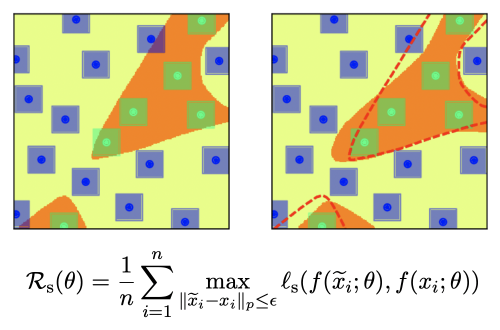

</img>


[](https://pypi.org/project/smart-pytorch/) 

# SMART - PyTorch

A PyTorch implementation of <a href="https://aclanthology.org/2020.acl-main.197.pdf">SMART</a>, a regularization technique to fine-tune pretrained language models. 

## Install

```bash
$ pip install smart-pytorch
```

## Usage

### Basic Example

```py
import torch
from smart_pytorch import SMARTLoss

# Define function that will be perturbed (usually our network)
eval_fn = torch.nn.Linear(in_features=10, out_features=20)

# Define loss function between states 
loss_fn = nn.MSELoss()

# Norm used to normalize the gradient 
inf_norm = lambda x: torch.norm(x, p='inf', dim=-1, keepdim=True)

# Initialize regularization loss
regularizer = SMARTLoss(
    eval_fn = eval_fn, 
    loss_fn = loss_fn,
    norm_fn = inf_norm  # Norm used to normalize the gradient (default = inf_norm)
    num_steps = 1,      # Number of optimization steps to find noise (default = 1)
    step_size = 1e-3,   # Step size to improve noise (default = 1e-3)
    epsilon = 1e-6,     # Noise norm constraint (default = 1e-6)
    noise_var = 1e-5    # Initial noise variance (default = 1e-5)
)

# Compute initial input embed and output state 
embed = torch.rand(1, 10) # [batch_size, in_features]
state = eval_fn(embed) # [batch_size, out_featueres]

# Compute regularation loss 
loss = regularizer(embed, state)
loss # tensor(0.5747812986, grad_fn=<AddBackward0>)
```

Where `eval_fn` is a function (usually a neural network) that takes as input an embedding `embed` and produces as output one or multiple states `state`. Internally, this function is used to perturb the input `embed` with noise to get a perturbed `state` which is compared with the initially provided `state`. When `eval_fn` outputs more than one state, we have to provide a list of loss functions in `loss_fn` (this can be useful if we want to regularize multiple layers in the network). 


### BERT Classification Example

This example demostrates how to wrap a BERT classifier from Huggingface to use with SMART, the `eval_fn` in this case takes as input the embedding of the word vectors and produces the `log_softmax` of the logits which is compared with a `kl_div` as `loss_fn` function. 

```py
import torch
import torch.nn as nn
import torch.nn.functional as F

from smart_pytorch import SMARTLoss
from transformers import BertTokenizer, BertForSequenceClassification

class SMARTBertClassificationLoss(nn.Module):
    
    def __init__(self, model, **kwargs):
        super().__init__()
        self.model = model 
        self.smart = SMARTLoss(
            eval_fn = self.eval, 
            loss_fn = self.loss,
            **kwargs
        )
        
    def loss(self, x, y):
        return F.kl_div(x, y, reduction = 'batchmean', log_target=True)
        
    def eval(self, embed):
        outputs = self.model.bert(inputs_embeds=embed)
        pooled = outputs[1]
        logits = self.model.classifier(pooled)
        return F.log_softmax(logits, dim=1)
    
    def forward(self, embed, state):
        return self.smart(embed, state)
    

num_labels = 3
model = BertForSequenceClassification.from_pretrained('bert-base-uncased', num_labels=num_labels)
tokenizer = BertTokenizer.from_pretrained('bert-base-uncased')
regularizer = SMARTBertClassificationLoss(model)

text = "Input text..."
inputs = tokenizer(text, return_tensors='pt')
outputs = model(**inputs)    

# Compute reference embed and state from input tokens and output logits 
embed = model.bert.embeddings(inputs['input_ids'], inputs['token_type_ids']) # [1, 7, 768]
state = F.log_softmax(outputs['logits'], dim=1) # [1, num_labels]

loss = regularizer(embed, state)
loss # tensor(0.0009563789, grad_fn=<AddBackward0>)

```


## Citations

```bibtex
@inproceedings{Jiang2020SMARTRA,
  title={SMART: Robust and Efficient Fine-Tuning for Pre-trained Natural Language Models through Principled Regularized Optimization},
  author={Haoming Jiang and Pengcheng He and Weizhu Chen and Xiaodong Liu and Jianfeng Gao and Tuo Zhao},
  booktitle={ACL},
  year={2020}
}
```